 

  

 

##   About Me

I'm a B.Tech Computer Science (AI/ML) student at **DIT University**, Dehradun, building production-grade software across full-stack engineering, AI/RAG systems, and distributed systems — while competing at a Master-level standard in competitive programming.

- **Focus areas** — System Design · Distributed Systems · LLM Infrastructure
- **Builds with** — Full-stack apps · RAG pipelines · Vector databases · PWAs · DevOps
- **Competitive programming** — 2,000+ problems solved · CF Master · LC Guardian
- **Currently** — Open to **SDE Internships, 2025–26**

 

**Education**

| Institution | Degree | GPA | Location |
|:--|:--|:--:|:--|
| DIT University | B.Tech, Computer Science (AI/ML) | 8.41 / 10 | Dehradun, India |

 

##   Competitive Programming

| Platform | Rating | Standing |
|:--|:--:|:--|
| **Codeforces** | `2131` — Master | 56th in India · Top 0.8% globally |
| **LeetCode** | `2360+` — Guardian | #169 / 30,000+ in Contest 462 · Top 0.4% |
| **CodeChef** | `2132` — 5★ | 335th in India |
| **Total Problems Solved** | `2,000+` | Across CF, LC, CSES, VJudge, HackerRank |
| **Best Contest Finish** | `45 / 20,000+` | CF Round 1068 Div. 2 · Top 0.003% globally |

**Topics I compete in**

 

 

##   GitHub Analytics

> The two cards below are generated **once** by the included GitHub Action (`.github/workflows/grs.yml`) and committed into this repo as static SVGs — so they don't depend on the public `github-readme-stats.vercel.app` instance, which the maintainers themselves warn can break under shared rate limits. Run the workflow once from the **Actions** tab to populate them (see the comment at the top of the workflow file for the 2-minute setup).

  

  

 

##   Achievements & Milestones

| Year | Achievement | Detail |
|:--:|:--|:--|
| 2025 | **Amazon ML Summer School** | Selected — Top 5% of 60,000+ applicants |
| 2025 | **Codeforces Round 1068 Div. 2** | Rank 45 / 20,000+ — Top 0.003% globally |
| 2025 | **LeetCode Weekly Contest 462** | Rank #169 / 30,000+ |
| 2025 | **GirlScript Summer of Code** | Open Source Contributor — Node.js / Python |

 

##   Tech Stack

**Languages**
 

  

**Frontend**
 

  

**Backend & APIs**
 

  

**Data & Infrastructure**
 

  

**AI / ML & DevOps**
 

  

 

##   Featured Projects

### DIT PYQ Hub — Full-Stack Academic Resource Platform

A production-grade PWA for browsing, uploading, and downloading university question papers, built offline-first for unreliable campus networks.

| Metric | Result |
|:--|:--|
| Uptime | 99.9% |
| UI sync latency | Sub-50ms via TanStack Query v5 optimistic updates + Supabase Realtime |
| Download counters | `O(1)` via PL/pgSQL triggers — eliminated expensive `COUNT(*)` queries |
| Offline support | Multi-strategy Workbox caching (NetworkFirst, CacheFirst, StaleWhileRevalidate) |
| Security | Rate limiting, Zod validation, watermarked delivery, row-level security |

`React 18` `TypeScript` `Node.js` `Express` `Supabase` `PostgreSQL` `DigitalOcean` `GitHub Actions`

 

### Legal Lens — AI-Powered Legal Research Platform (RAG)

A retrieval-augmented generation pipeline that makes statutory research accessible, searching over 1,000+ chunked legal documents.

| Metric | Result |
|:--|:--|
| Query latency | Sub-150ms |
| Retrieval accuracy | 92% top-k |
| Research time saved | ~85% reduction |

`Next.js 14` `TypeScript` `Llama 3.3 70B (Groq)` `LangChain` `Pinecone` `MongoDB`

 

### Dengue Spot — Real-Time Disease Surveillance Platform

A community-driven public health platform with live geo-tagged outbreak risk mapping and computer-vision-assisted reporting.

| Component | Implementation |
|:--|:--|
| Real-time alerts | Socket.io bi-directional chat & broadcasting |
| Breeding-site detection | Roboflow CV pipeline, auto-classification |
| Mapping | Leaflet.js + indexed MongoDB geospatial queries |
| Security | RBAC, rate limiting, IP banning, OAuth 2.0, JWT |

`React` `Node.js` `Python` `MongoDB` `Socket.io` `Roboflow`

 

 

##   Open Source & Community

I contributed to **GirlScript Summer of Code** as a Node.js / Python contributor, and I'm always glad to collaborate on interesting full-stack, AI/RAG, or competitive-programming-adjacent open-source projects. Feel free to open an issue, send a PR, or just reach out.

 

##   Let's Connect

 

  

